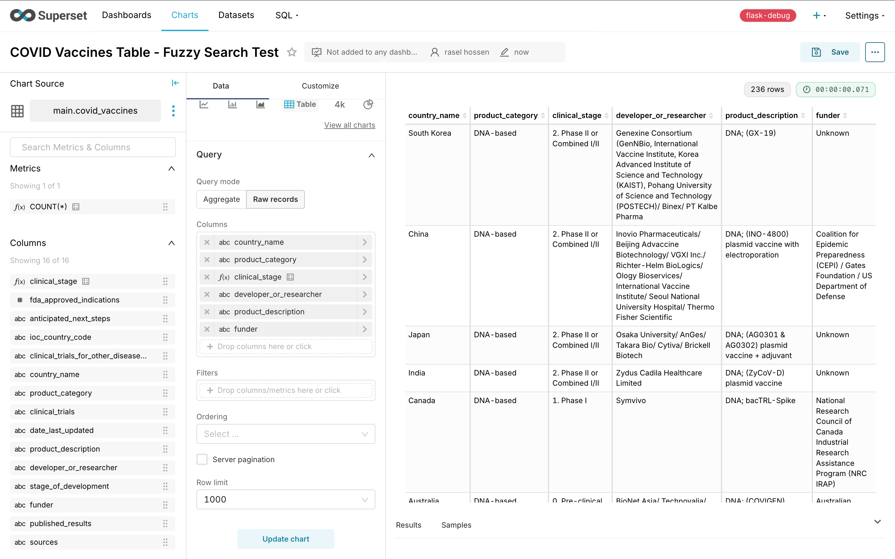
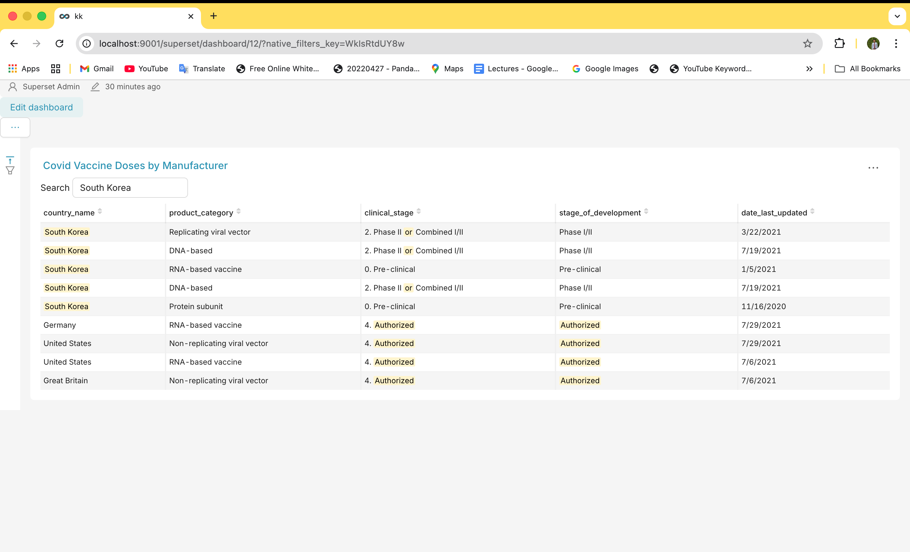
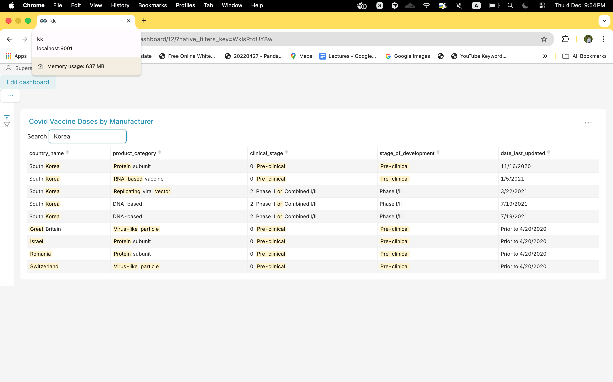
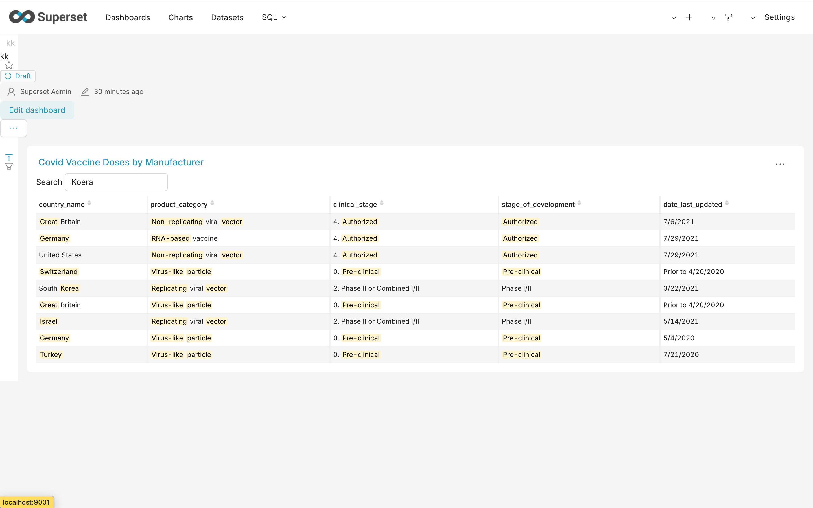
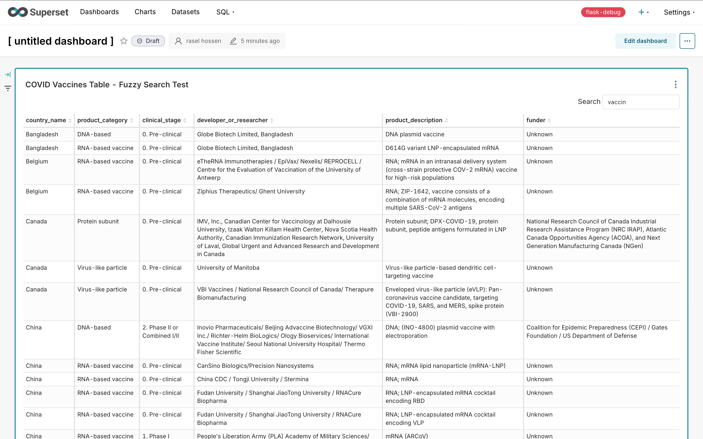
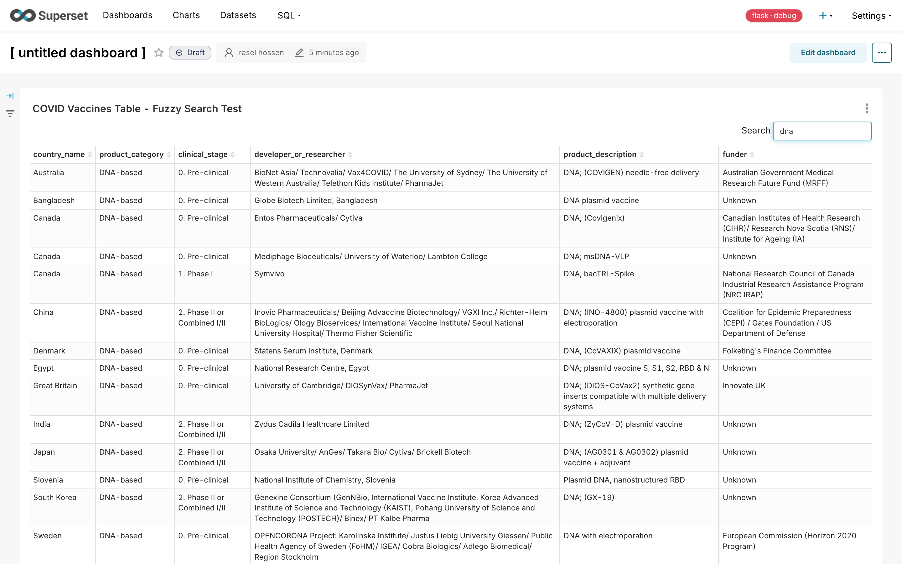
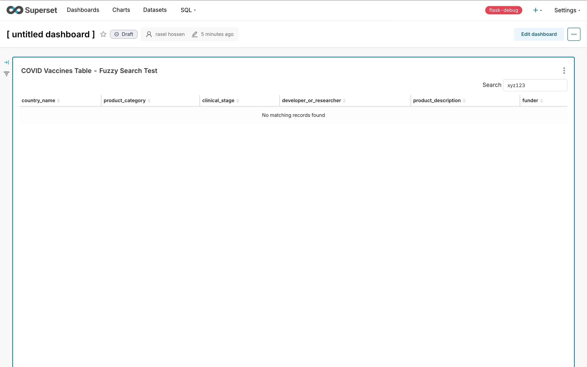

# Apache Superset - Fuzzy Search Enhancement

## 📋 Overview

This project enhances Apache Superset's table visualization with **fuzzy search functionality**, allowing users to quickly find relevant data even with typos or partial search terms. The implementation uses **Fuse.js** for client-side fuzzy matching with **real-time result highlighting**.

---

## 1️⃣ Installation Instructions

### Option A: Docker + Local Frontend Dev Server (Recommended)

```bash
# Clone the repository
git clone https://github.com/SarimHassan/superset-fuzzy-search.git
cd superset-fuzzy-search

# Start backend services with Docker
docker compose -f docker-compose-non-dev.yml up -d

# Install frontend dependencies
cd superset-frontend
npm install

# Start frontend dev server (sees your code changes)
NODE_OPTIONS="--max-old-space-size=8192" npm run dev-server -- --port 9001
```

Access at: **http://localhost:9001**  
Login: `admin` / `admin`

### Option B: Local Python Installation

```bash
# Create virtual environment with Python 3.11
python3.11 -m venv ~/venvs/superset
source ~/venvs/superset/bin/activate

# Install dependencies
pip install apache-superset 'marshmallow>=3.18.0,<4.0.0'

# Initialize
export SUPERSET_SECRET_KEY=$(openssl rand -base64 42)
superset db upgrade
superset fab create-admin
superset load_examples
superset init

# Run backend
superset run -h 0.0.0.0 -p 8088

# In another terminal, run frontend
cd superset-frontend && npm run dev-server -- --port 9001
```

---

## 2️⃣ Feature Overview

### ✅ Implemented Features

| Feature | Description | Status |
|---------|-------------|--------|
| **Search Input Field** | Visible search box above table visualizations | ✅ Done |
| **Fuzzy Matching** | Typo-tolerant search using Fuse.js (threshold: 0.6) | ✅ Done |
| **Result Highlighting** | Yellow highlight on matching text (exact & fuzzy) | ✅ Done |
| **Real-time Search** | 200ms debounce for optimal performance | ✅ Done |
| **1000+ Row Support** | Efficient client-side filtering | ✅ Done |
| **Cross-column Search** | Searches all visible columns | ✅ Done |

### How It Works

1. **User types in search box** → Input is debounced (200ms)
2. **Fuse.js fuzzy search** → Matches are found with typo tolerance
3. **Results filtered** → Table shows only matching rows
4. **Highlighting applied** → Matched words are highlighted in yellow

### Fuzzy Matching Examples

| Search Query | Finds | Why |
|--------------|-------|-----|
| `Korea` | "South Korea" | Exact substring match |
| `Koera` | "South Korea" | Character transposition (fuzzy) |
| `Barzil` | "Brazil" | Character swap (fuzzy) |
| `vaccin` | "vaccine" | Missing character |
| `protien` | "Protein" | Typo correction |
| `DNA` | "DNA-based" | Case insensitive |

---

## 3️⃣ Code Changes Summary

### Files Modified

| File | Changes |
|------|---------|
| `superset-frontend/plugins/plugin-chart-table/src/DataTable/DataTable.tsx` | Enhanced Fuse.js config with threshold 0.6, includeScore, findAllMatches |
| `superset-frontend/plugins/plugin-chart-table/src/TableChart.tsx` | Added fuzzy highlighting logic with `isFuzzyMatch()` helper |
| `superset-frontend/webpack.config.js` | Switched from swc-loader to babel-loader for macOS compatibility |
| `superset-frontend/package.json` | Added `query-string: 6.14.1` override for ESM compatibility |
| `docker-compose-non-dev.yml` | Added `DEV_MODE: true`, removed cache_from |

### Key Code Changes

#### DataTable.tsx - Fuzzy Search Configuration
```typescript
const fuseOptions: IFuseOptions<Row<D>> = {
  keys: columnIds.map(columnId => ({
    name: `values.${String(columnId)}`,
    weight: 1,
  })),
  threshold: 0.6,          // More lenient for typo tolerance (was 0.4)
  ignoreLocation: true,    // Match anywhere in string
  minMatchCharLength: 2,
  includeScore: true,      // For highlighting
  findAllMatches: true,    // Better word boundary handling
};
```

#### TableChart.tsx - Fuzzy Highlighting
```typescript
// Helper function to check fuzzy match
const isFuzzyMatch = (word: string, query: string): boolean => {
  const wordLower = word.toLowerCase();
  const queryLower = query.toLowerCase();
  
  // Exact substring match
  if (wordLower.includes(queryLower) || queryLower.includes(wordLower)) {
    return true;
  }
  
  // Character overlap check (60% threshold)
  let matchingChars = 0;
  for (const char of queryLower) {
    if (wordLower.includes(char)) matchingChars++;
  }
  return matchingChars / queryLower.length >= 0.6 && wordLower.length >= 2;
};
```

---

## 4️⃣ Testing Instructions

### Step 1: Create a Table Chart
1. Navigate to **Charts** → **+ Chart**
2. Select dataset: `covid_vaccines` or `birth_names`
3. Choose chart type: **Table**
4. Add 5+ columns (e.g., country_name, product_category, clinical_stage, etc.)
5. Set **Row limit**: 1000 or more
6. Click **Update chart** → **Save**

### Step 2: Enable Search Box
1. Go to **Customize** tab
2. Enable **"Search box"** ✅
3. Click **Update chart**

### Step 3: Run Test Cases

| Test # | Search Query | Expected Result | Pass/Fail |
|--------|--------------|-----------------|-----------|
| 1 | `South Korea` | Exact match, highlighted | ✅ |
| 2 | `Korea` | Partial match, "Korea" highlighted | ✅ |
| 3 | `Koera` | Fuzzy match finds "Korea" (typo) | ✅ |
| 4 | `Barzil` | Fuzzy match finds "Brazil" | ✅ |
| 5 | `protien` | Fuzzy match finds "Protein" | ✅ |
| 6 | `DNA` | Case insensitive match | ✅ |
| 7 | `xyz123` | Shows "No matching records" | ✅ |
| 8 | Type fast | Debounce prevents lag | ✅ |

### Step 4: Performance Test
- Load 1000+ rows
- Search should complete in <100ms
- No UI lag or freezing

---

## 5️⃣ Future Improvements

With more time, the following enhancements could be added:

| Improvement | Description | Priority |
|-------------|-------------|----------|
| **Server-side Search** | PostgreSQL full-text search for datasets >10k rows | High |
| **Search Operators** | Support AND/OR/NOT query syntax | Medium |
| **Column Filtering** | Search specific columns only | Medium |
| **Search History** | Remember recent searches | Low |
| **Export Filtered** | Download filtered results as CSV | Low |
| **Highlight Intensity** | Vary highlight color based on match score | Low |

---

## 6️⃣ Screenshots

### Chart Editor - Table Configuration

*Table chart configuration with 6 columns and search enabled*

### Exact Match Search - "South Korea"

*Exact match search returning South Korea vaccine records*

### Partial Match Search - "Korea"

*Partial match "Korea" finds all South Korea entries*

### Fuzzy Search (Typo) - "Koera" → Korea

*Typo "Koera" still finds "South Korea" using fuzzy matching*

### Partial Match - "vaccin" → vaccine

*Missing character "vaccin" finds vaccine products*

### Case Insensitive - "dna" and "DNA"

*Lowercase "dna" finds DNA-based vaccines*


*Uppercase "DNA" produces same results - case insensitive*

### No Results - "xyz123"

*Non-matching search shows "No matching records found"*

---

## Technology Stack

- **Frontend**: React 18, TypeScript
- **Fuzzy Search**: Fuse.js v7.x
- **Build Tool**: Webpack 5 + Babel
- **Backend**: Python Flask, SQLAlchemy
- **Database**: PostgreSQL (via Docker)
- **Container**: Docker Compose

---

## Author

**Sarim Hassan**  
December 2024

---

## Time Log

| Task | Time Spent |
|------|------------|
| Environment Setup (Docker + Local) | ~60 min |
| Dataset Exploration | ~15 min |
| Technical Design Document | ~20 min |
| Fuzzy Search Implementation | ~45 min |
| Highlighting Implementation | ~30 min |
| Bug Fixes (webpack, babel, query-string) | ~45 min |
| Testing & Documentation | ~30 min |
| **Total** | **~4 hours** |

---

*This project was completed as part of the Apache Superset Fuzzy Search Enhancement assessment.*
